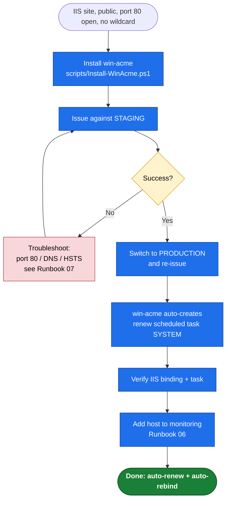

# 01 — Windows IIS, Public Site (HTTP-01) Runbook

**Use this when:** the certificate is for an **IIS website** that is **reachable from the public internet on port 80**, and you do **not** need a wildcard.
**Tool:** [win-acme](https://www.win-acme.com/) (`wacs.exe`).
**Validation:** HTTP-01 (win-acme self-hosts the challenge on port 80).
**Result:** Certificate issued, bound to the IIS site, and a Windows Scheduled Task created that renews and re-binds automatically — no further action.

> Not your scenario? Internal site / port 80 blocked / wildcard → **[02](02-Windows-DNS01-Wildcard.md)**. Non-IIS service → **[03](03-Windows-NonIIS-Services.md)**.
>
> **Replacing a cert that's already on this site** (default self-signed, GoDaddy, DigiCert, any vendor)? This runbook still applies — win-acme re-binds the existing HTTPS binding to the new Let's Encrypt cert. Pair it with **[08](08-Replacing-Existing-Certs.md)** for the inventory, safe cutover, and old-cert cleanup.

---

## Prerequisites

- [ ] Windows Server with the **IIS role** installed and the target site created.
- [ ] The site has an **HTTP (port 80) binding** with the correct **host name** (e.g. `www.example.com`). win-acme reads host names from IIS bindings.
- [ ] Public DNS `A`/`AAAA` record for the host points at this server.
- [ ] **Inbound TCP 80 is reachable from the internet** (firewall + any cloud NSG/security group). The CA connects on port 80 to validate. *(443 can be open too, but 80 is what HTTP-01 needs.)*
- [ ] Local admin rights on the server (the renewal task runs as `SYSTEM`).
- [ ] A monitored ops email address for failure alerts.

> **HSTS gotcha:** if the site sends an HSTS header that forces HTTP→HTTPS, HTTP-01 self-validation can break. If you hit redirect/validation errors, switch this host to DNS-01 ([02](02-Windows-DNS01-Wildcard.md)). See [07](07-Operations-and-Troubleshooting.md).

---

## Decision flow



> 📊 **Slide-ready image:** [PNG](docs/diagrams/runbook01-iis-http01.png) · [SVG](docs/diagrams/runbook01-iis-http01.svg)

---

## Step 0 — Preflight (run this first on a fresh box)

Before anything else, validate the server is ready — and let the preflight install the IIS role and win-acme for you:

```powershell
# Check-only (read-only):
& "E:\NOC\SSL_Rotation_Windows\scripts\Preflight-Check.ps1" -Domains example.com

# Set up a fresh box (installs IIS role + win-acme), then re-check:
& "E:\NOC\SSL_Rotation_Windows\scripts\Preflight-Check.ps1" -Domains example.com -InstallIIS -InstallWinAcme -NotifyEmail ops@example.com
```

It verifies elevation/OS/PowerShell, the IIS role + module, TLS 1.2, outbound reachability to Let's Encrypt, win-acme, and DNS resolution, then prints **READY / NOT READY**. Resolve any `FAIL` before continuing. (If win-acme was installed by preflight, you can skip Step 1.)

## Step 1 — Install win-acme

Run the bootstrap script (downloads the latest release, extracts to `C:\win-acme`, unblocks the DLLs, and writes a baseline `settings.json`):

```powershell
# From an elevated PowerShell prompt
& "E:\NOC\SSL_Rotation_Windows\scripts\Install-WinAcme.ps1" -InstallPath "C:\win-acme" -NotifyEmail "ops@example.com"
```

> Prefer to do it by hand? Download the **`win-acme...x64.trimmed.zip`** from the [releases page](https://github.com/win-acme/win-acme/releases), extract to `C:\win-acme`, then unblock:
> ```powershell
> Get-ChildItem C:\win-acme\*.dll | Unblock-File
> ```

The script and the `settings.json` reference are documented in [03](03-Windows-NonIIS-Services.md#appendix-settingsjson-reference); the only field that matters now is the ACME directory URL, which we point at **staging** for Step 2.

---

## Step 2 — Issue against STAGING first

Confirm `settings.json` points at staging (the install script sets this when you pass `-Staging`, or edit it):

```json
"BaseUri": "https://acme-staging-v02.api.letsencrypt.org/directory"
```

Find the IIS site ID:

```powershell
Import-Module WebAdministration
Get-Website | Select-Object Name, ID, State, @{n='Bindings';e={($_.bindings.Collection.bindingInformation) -join ', '}}
```

Issue unattended (replace site id and email):

```powershell
cd C:\win-acme
.\wacs.exe --source iis --siteid 1 `
  --emailaddress ops@example.com --accepttos --closeonfinish --verbose
```

- `--source iis` auto-discovers the host names from the site's bindings and auto-selects HTTP-01 self-hosting + IIS installation.
- To pin specific names instead of all bindings, add `--host www.example.com,example.com`.

**Expected:** the log ends with the cert stored and bound, and the issuer shows a **`(STAGING)`** intermediate. The browser will warn it's untrusted — correct for staging.

If it fails, it's almost always port 80 reachability, DNS, or HSTS → [07](07-Operations-and-Troubleshooting.md).

---

## Step 3 — Cut over to PRODUCTION

1. Edit `C:\win-acme\settings.json`, set the production directory:
   ```json
   "BaseUri": "https://acme-v02.api.letsencrypt.org/directory"
   ```
2. Remove the staging renewal so it doesn't linger:
   ```powershell
   cd C:\win-acme
   .\wacs.exe --list                       # note the staging renewal id/friendlyname
   .\wacs.exe --cancel --friendlyname "[IIS] www.example.com"
   ```
3. Re-issue against production (same command as Step 2):
   ```powershell
   .\wacs.exe --source iis --siteid 1 `
     --emailaddress ops@example.com --accepttos --closeonfinish --verbose
   ```

**Expected:** issuer is a real Let's Encrypt intermediate (e.g. `R10`/`E5`), browser trusts it, no warning.

---

## Step 4 — Confirm automatic renewal is set up

win-acme creates the scheduled task automatically on first issuance. Verify:

```powershell
# Scheduled task exists (daily, runs as SYSTEM)
Get-ScheduledTask -TaskPath "\win-acme*\" | Select-Object TaskName, State
Get-ScheduledTaskInfo -TaskName (Get-ScheduledTask -TaskPath "\win-acme*\").TaskName |
  Select-Object LastRunTime, LastTaskResult, NextRunTime

# The renewal is registered
.\wacs.exe --list
```

Defaults (configurable in `settings.json` → `ScheduledTask`): runs **daily ~09:00** with a random delay, and **renews when the cert reaches 55 days old** (≈30 days before a 90-day expiry). For 45-day certs, lower `RenewalDays` to ~20 — see the [settings reference](03-Windows-NonIIS-Services.md#appendix-settingsjson-reference).

**Dry-run the renewal path** (forces a renew now; safe — counts toward duplicate limit, so do sparingly on production):

```powershell
.\wacs.exe --renew --force --verbose
```

---

## Step 5 — Verify the live binding

```powershell
# The cert is in LocalMachine\My and bound to the HTTPS binding
Get-ChildItem Cert:\LocalMachine\My |
  Where-Object Subject -like "*www.example.com*" |
  Select-Object Subject, NotAfter, Thumbprint

# Confirm what's actually served on the wire
$h='www.example.com'
$c=[Net.HttpWebRequest]::Create("https://$h"); $c.AllowAutoRedirect=$false
try { $c.GetResponse() | Out-Null } catch {}
$c.ServicePoint.Certificate | ForEach-Object {
  [PSCustomObject]@{ Subject=$_.Subject; Expires=$_.GetExpirationDateString() }
}
```

Or from any client: `openssl s_client -connect www.example.com:443 -servername www.example.com` and check the dates/issuer.

---

## Step 6 — Add to monitoring

Register the host in the independent expiry monitor so a silent renewal failure pages someone. See [06](06-Monitoring-and-Alerting.md) and add `www.example.com` to `Check-CertExpiry.ps1`'s host list.

---

## Done — what you just built

- A production Let's Encrypt cert bound to the IIS site.
- A `SYSTEM` scheduled task that renews ~30 days before expiry and **re-binds IIS automatically** (no scripts needed for IIS).
- Independent monitoring as a safety net.

## Rollback / removal

```powershell
cd C:\win-acme
.\wacs.exe --list                                   # find the friendlyname
.\wacs.exe --cancel --friendlyname "[IIS] www.example.com"   # stops renewals
```
Cancelling removes the renewal (and the task if it's the last one). The existing binding/cert stays until it expires; rebind manually in IIS if you're decommissioning.

---

### References
- win-acme: [CLI reference](https://www.win-acme.com/reference/cli) · [automatic renewal](https://www.win-acme.com/manual/automatic-renewal) · [settings](https://www.win-acme.com/reference/settings)
- [Let's Encrypt HTTP-01 challenge](https://letsencrypt.org/docs/challenge-types/#http-01-challenge)
