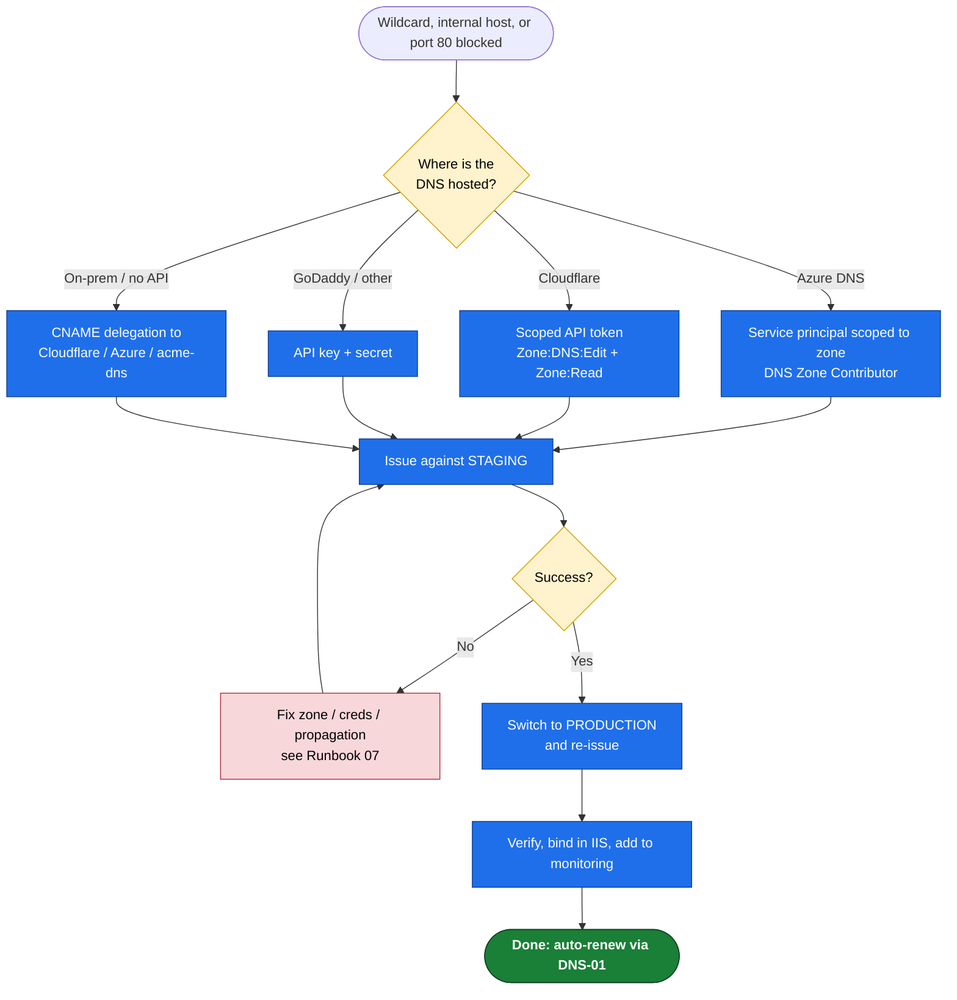
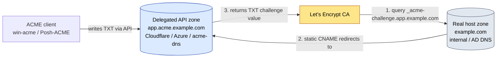

# 02 — Windows DNS-01 & Wildcard Runbook

**Use this when** any of these is true:
- You need a **wildcard** certificate (`*.example.com`), **or**
- The IIS site / host is **internal** (not reachable from the internet), **or**
- **Port 80 is blocked** so HTTP-01 ([01](01-Windows-IIS-HTTP01-Runbook.md)) can't validate.

**Tool:** [win-acme](https://www.win-acme.com/) (`wacs.exe`) with a DNS validation plugin.
**Validation:** DNS-01 (writes a temporary `_acme-challenge` TXT record via your DNS provider's API).
**Result:** Cert issued and bound to IIS (or stored as PFX for [03](03-Windows-NonIIS-Services.md)), with an automatic renewal task.

> Wildcards can **only** be issued via DNS-01 — there is no HTTP-01 path for them.
>
> **Replacing existing wildcard certs** (e.g. three wildcard domains currently on GoDaddy/DigiCert, or a self-signed default)? Issue here exactly as below — win-acme re-binds each site to the new Let's Encrypt wildcard. Pair with **[08](08-Replacing-Existing-Certs.md)** for inventory, cutover, and cleanup of the old vendor certs.
>
> **Not sure which wildcards you need?** The IIS script scans your bindings, groups host names into the minimum set of wildcard certs (names sharing a parent domain collapse onto one cert), shows what's already covered, and can **generate + bind them live** for you:
> ```powershell
> irm https://xphox2.github.io/Cert-Man-Windows/setup-iis.ps1 | iex
> ```
> It supports **Cloudflare, Azure DNS, and GoDaddy** directly, plus a **Manual** option (win-acme shows the TXT record and you create it by hand) for **any other DNS provider**. Manual certs do **not** auto-renew — for hands-off renewal on a 3rd-party DNS, use **CNAME delegation** (§A) instead. The commands below are the manual equivalent if you'd rather drive `wacs.exe` yourself.

---

## Prerequisites

> **Run the preflight first** (especially on a fresh box). The interactive one-liner validates **ACME + DNS**, installs the **win-acme pluggable build**, and walks you through a **real DNS-01 validation test** against Let's Encrypt staging — proving your DNS API credentials and propagation work *before* you touch production:
> ```powershell
> irm https://xphox2.github.io/Cert-Man-Windows/preflight.ps1 | iex
> ```
> When prompted, choose to run the DNS-01 test and pick your provider (Cloudflare / Azure DNS / GoDaddy / Manual). The **IIS role + wildcard generation** is the *next* step — the IIS script (`setup-iis.ps1`) installs IIS if missing and does the issuance/binding. For a scripted/non-interactive preflight with parameters, see [scripts/Preflight-Check.ps1](scripts/Preflight-Check.ps1).

- [ ] win-acme installed (`scripts\Install-WinAcme.ps1` — see [01 Step 1](01-Windows-IIS-HTTP01-Runbook.md#step-1--install-win-acme), or installed by the preflight above).
- [ ] DNS for the domain is hosted somewhere with an **API** — Azure DNS, Cloudflare, or GoDaddy — **or** you'll use **CNAME delegation** for on-prem DNS (see §A).
- [ ] API credentials created with **least privilege** (one zone, DNS-edit only). Provider-specific steps below.
- [ ] For wildcard binding to IIS: the IIS site must have an HTTPS binding for a concrete host under the wildcard (you bind a real host, e.g. `app.example.com`, using the wildcard cert).
- [ ] Outbound HTTPS from the server to the DNS provider API and to Let's Encrypt.

---

## Decision flow



> 📊 **Slide-ready image:** [PNG](docs/diagrams/runbook02-dns01.png) · [SVG](docs/diagrams/runbook02-dns01.svg)

---

## Section A — Any DNS with no API (Network Solutions & registrars without an API)

If the domain's DNS has **no automatable API** — **Network Solutions / the old MyDomain.com**, many registrars, internal AD DNS — nothing can write the `_acme-challenge` TXT *there* automatically. That's how DNS-01 works, not a tool limit. The fix is always the same: add **one static CNAME** at the registrar that redirects `_acme-challenge` to a **delegation target you control that *does* have an API**. The CA follows the CNAME; the registrar is never touched again.

You choose the delegation target — and that choice decides the tooling:

| Delegation target | Server to run? | Tool | Windows/PowerShell native? |
|---|---|---|---|
| **A DNS zone you control** (Azure DNS, Cloudflare, Route53, your own BIND/PowerDNS) | none — a zone you already control | **Posh-ACME `-DnsAlias`** | ✅ **recommended** |
| **acme-dns** (dedicated server) | yes — and the server is **Linux-only** (no Windows binary) | win-acme `acme-dns` plugin | ❌ server isn't |

> `https://auth.acme-dns.io` is a **public shared** acme-dns instance — fine for a quick test, **not production-safe**. Both targets above avoid it.

### Recommended (Windows/PowerShell): delegate to a zone you control — no server

Use **[`scripts/Issue-DnsAlias.ps1`](scripts/Issue-DnsAlias.ps1)** (Posh-ACME `-DnsAlias`). You keep one small delegation zone you control (e.g. `acme.xphox.net` on Azure DNS or Cloudflare); every no-API domain adds one CNAME into it; Posh-ACME — running on Windows — writes the TXT into your zone via that provider's plugin. No acme-dns, no Linux, no Docker.

1. Pick the delegation FQDN, e.g. `example.acme.xphox.net`.
2. **At the registrar, add ONE CNAME** (covers wildcard + apex of the same root):
   ```
   _acme-challenge.example.com.   CNAME   example.acme.xphox.net.
   ```
3. Run `Issue-DnsAlias.ps1` → choose your delegation provider (Cloudflare / Azure / Route53 / other) → it issues and **auto-renews** (Posh-ACME stores the plugin + alias).

### Alternative: acme-dns (a dedicated server you run)

The purpose-built tool is **[acme-dns](https://github.com/acme-dns/acme-dns)** — a minimal DNS server whose only job is `_acme-challenge` TXT records. Both win-acme and Posh-ACME support it. Use it if you'd rather run a self-contained delegation server than keep a cloud DNS zone (note: the server is **Linux-only**).

### How it works (one-time CNAME, then automatic)
1. The ACME client registers once with an acme-dns server → it hands back a random subdomain like `a1b2c3d4.auth.example.com`.
2. **At your registrar (e.g. Network Solutions), add ONE static CNAME** (every registrar can do this):
   ```
   _acme-challenge.app.example.com.   CNAME   a1b2c3d4.auth.example.com.
   ```
   One CNAME per **registrable domain** covers both the wildcard and the apex (same challenge name). Set it once; never touch it again.
3. Forever after, the client writes the TXT into **acme-dns** (via its locked-down API) — never your registrar. Let's Encrypt follows the CNAME and validates. **Auto-renews.**

Security: the acme-dns credential can *only* set a throwaway `_acme-challenge` TXT — even if it leaks, your real DNS is untouched.

### Running acme-dns
- **Self-host (recommended for production):** a single Go binary; you run **one** server and every customer CNAMEs to it. Full setup (DNS delegation, `config.cfg`, Docker/systemd/Windows, hardening, onboarding) is in **[Runbook 09 — acme-dns Server Setup](09-AcmeDNS-Server-Setup.md)**.
- **Public test server:** `https://auth.acme-dns.io` for quick validation; self-host for production.

### Wiring it up with our scripts
- **Preflight** → DNS test → choose **acme-dns**. win-acme prompts for the acme-dns server, registers, and prints the CNAME to create. Add it at your registrar, wait ~1 min, re-run the test to confirm validation.
- **Issuance** (`setup-iis.ps1`) → choose **acme-dns** in the provider menu; it issues and binds, and renewals are automatic because the CNAME is permanent.

> **Plain CNAME delegation to a supported provider** is the same idea without acme-dns: point `_acme-challenge.host` at a zone you *do* have an API for (Cloudflare/Azure DNS). Use it only if you already run such a zone — otherwise acme-dns is cleaner, since it needs no other provider.



> 📊 **Slide-ready image:** [PNG](docs/diagrams/cname-delegation.png) · [SVG](docs/diagrams/cname-delegation.svg)

The rest of this runbook then proceeds exactly as for a normal API-hosted zone.

---

> **Provider coverage (no assumptions):** the scripts' DNS menu offers **acme-dns**, **Cloudflare / Azure / GoDaddy** with guided credential prompts, **Manual** (one-off), and **"Other provider"** — which lists **win-acme's full ~20 in-box DNS plugins** (Route53, DNSMadeEasy, DigitalOcean, Linode, Hetzner, LuaDNS, NS1, RFC2136, TransIP, Aliyun, Tencent, …), downloads the chosen plugin, and **win-acme then prompts for that provider's credentials** (so we never hard-code per-provider argument names). Any provider with a win-acme plugin works directly; anything with no API uses **acme-dns**. The three guided sections below are just shortcuts; the pattern is identical for every provider.

## Section 1 — Azure DNS

**Create a least-privilege service principal scoped to the DNS zone:**

```bash
# az CLI — scope to the single zone, role = DNS Zone Contributor
az ad sp create-for-rbac --name "winacme-dns01" \
  --role "DNS Zone Contributor" \
  --scopes "/subscriptions/<sub-id>/resourceGroups/<dns-rg>/providers/Microsoft.Network/dnszones/example.com"
# Note the appId (client id), password (secret), tenant.
```

**Issue (wildcard + apex), staging first:**

```powershell
cd C:\win-acme
.\wacs.exe --source manual --host "*.example.com,example.com" `
  --validation azure `
  --azuretenantid   "<tenant-id>" `
  --azureclientid   "<app-id>" `
  --azuresecret     "<client-secret>" `
  --azuresubscriptionid "<sub-id>" `
  --azureresourcegroupname "<dns-rg>" `
  --store certificatestore `
  --installation iis --installationsiteid 1 `
  --emailaddress ops@example.com --accepttos --closeonfinish --verbose
```

> Drop `--installation iis --installationsiteid 1` and add `--store pfxfile --pfxfilepath C:\certs` if this cert is for a **non-IIS** service — then continue in [03](03-Windows-NonIIS-Services.md).

---

## Section 2 — Cloudflare

**Create a scoped API token** (Cloudflare dashboard → My Profile → API Tokens → Create Token → *Custom*):
- Permissions: **Zone : DNS : Edit** and **Zone : Zone : Read**
- Zone Resources: **Include → Specific zone → example.com**

**Issue (wildcard + apex), staging first:**

```powershell
cd C:\win-acme
# One-time: download the Cloudflare plugin into C:\win-acme and unblock it (pluggable build).
.\wacs.exe --source manual --host "*.example.com,example.com" `
  --validation cloudflare `
  --cloudflareapitoken "<scoped-token>" `
  --store certificatestore `
  --installation iis --installationsiteid 1 `
  --emailaddress ops@example.com --accepttos --closeonfinish --verbose
```

> **Plugin install:** DNS provider plugins are **separate downloads** and require the **pluggable** win-acme build (not the trimmed build). Easiest: let the installer fetch it — `& scripts\Install-WinAcme.ps1 -Staging -DnsPlugin cloudflare` (also accepts `azure`, `godaddy`, `route53`, `digitalocean`), or run the preflight one-liner which installs the plugin for the provider you pick. Manual alternative: download the matching `plugin.validation.dns.cloudflare...zip` from the [releases page](https://github.com/win-acme/win-acme/releases), extract the DLLs into `C:\win-acme`, then `Get-ChildItem C:\win-acme\plugin*.dll | Unblock-File`.

---

## Section 3 — GoDaddy / other registrar

**Create an API key/secret** (GoDaddy → Developer portal → API Keys → Production key).

```powershell
cd C:\win-acme   # GoDaddy plugin DLLs extracted + unblocked as in §2
.\wacs.exe --source manual --host "*.example.com,example.com" `
  --validation godaddy `
  --apikey    "<key>" `
  --apisecret "<secret>" `
  --store certificatestore `
  --installation iis --installationsiteid 1 `
  --emailaddress ops@example.com --accepttos --closeonfinish --verbose
```

> **Confirm plugin availability** for your exact provider before committing — GoDaddy/registrar plugin support is less consistent than Azure/Cloudflare. If your registrar isn't supported, use **CNAME delegation (§A)** to point the challenge at Cloudflare or Azure DNS instead. This is the recommended approach for any registrar without a reliable plugin.

---

## Step — Cut over to PRODUCTION

Same pattern as [01 Step 3](01-Windows-IIS-HTTP01-Runbook.md#step-3--cut-over-to-production):
1. Set `"BaseUri": "https://acme-v02.api.letsencrypt.org/directory"` in `settings.json`.
2. `.\wacs.exe --cancel --friendlyname "<staging renewal>"`.
3. Re-run the same issuance command. Credentials are stored encrypted in the renewal, so renewals don't re-prompt.

> **DNS-01 timing:** if validation fails intermittently, the TXT record likely hadn't propagated before the CA checked. win-acme waits and retries; persistent failures usually mean wrong zone/credential scope or a CNAME-delegation typo. See [07](07-Operations-and-Troubleshooting.md).

---

## Step — Verify & monitor

```powershell
# Renewal registered + scheduled task present
.\wacs.exe --list
Get-ScheduledTask -TaskPath "\win-acme*\" | Select-Object TaskName, State

# Cert present
Get-ChildItem Cert:\LocalMachine\My | Where-Object Subject -like "*example.com*" |
  Select-Object Subject, NotAfter, Thumbprint
```

Then bind in IIS if not auto-bound (Site → Bindings → https → select the wildcard cert + set the host name + check *Require SNI*), and add the host to [monitoring](06-Monitoring-and-Alerting.md).

The renewal task renews **and re-runs DNS-01 automatically** using the stored credentials — fully hands-off.

---

## Security notes specific to DNS-01

- DNS credentials can rewrite zone records — treat them as **high value**. Use the **most scoped** token your provider allows (single zone), and prefer **CNAME delegation to acme-dns** when you want the issuing host to only ever touch a throwaway zone.
- Rotate DNS API tokens on a schedule; update the renewal with `--validation ... ` re-run if the token changes.
- win-acme stores credentials in the renewal store encrypted with DPAPI under the `SYSTEM` account; keep `%programdata%\win-acme` ACL'd to `SYSTEM`/Administrators only.

---

### References
- win-acme DNS validation: [overview](https://www.win-acme.com/reference/plugins/validation/dns/) · [Azure](https://www.win-acme.com/reference/plugins/validation/dns/azure) · [Cloudflare](https://www.win-acme.com/reference/plugins/validation/dns/cloudflare)
- [Let's Encrypt DNS-01 / wildcard](https://letsencrypt.org/docs/challenge-types/#dns-01-challenge) · [acme-dns](https://github.com/joohoi/acme-dns)
