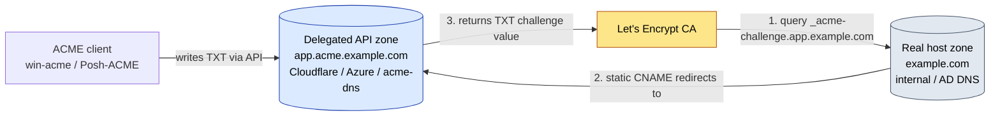

# 02 — Windows DNS-01 & Wildcard Runbook

**Use this when** any of these is true:
- You need a **wildcard** certificate (`*.example.com`), **or**
- The IIS site / host is **internal** (not reachable from the internet), **or**
- **Port 80 is blocked** so HTTP-01 ([01](01-Windows-IIS-HTTP01-Runbook.md)) can't validate.

**Tool:** [win-acme](https://www.win-acme.com/) (`wacs.exe`) with a DNS validation plugin.
**Validation:** DNS-01 (writes a temporary `_acme-challenge` TXT record via your DNS provider's API).
**Result:** Cert issued and bound to IIS (or stored as PFX for [03](03-Windows-NonIIS-Services.md)), with an automatic renewal task.

> Wildcards can **only** be issued via DNS-01 — there is no HTTP-01 path for them.
>
> **Replacing existing wildcard certs** (e.g. three wildcard domains currently on GoDaddy/DigiCert, or a self-signed default)? Issue here exactly as below — win-acme re-binds each site to the new Let's Encrypt wildcard. Pair with **[08](08-Replacing-Existing-Certs.md)** for inventory, cutover, and cleanup of the old vendor certs.

---

## Prerequisites

> **Run the preflight first** (especially on a fresh box). The interactive one-liner installs IIS + win-acme and walks you through a **real DNS-01 validation test** against Let's Encrypt staging — proving your DNS API credentials and propagation work *before* you touch production:
> ```powershell
> irm https://raw.githubusercontent.com/xphox2/Cert-Man-Windows/main/preflight.ps1 | iex
> ```
> When prompted, choose to run the DNS-01 test and pick your provider (Cloudflare / Azure DNS / GoDaddy). For a scripted/non-interactive version with parameters, see [scripts/Preflight-Check.ps1](scripts/Preflight-Check.ps1).

- [ ] win-acme installed (`scripts\Install-WinAcme.ps1` — see [01 Step 1](01-Windows-IIS-HTTP01-Runbook.md#step-1--install-win-acme), or installed by the preflight above).
- [ ] DNS for the domain is hosted somewhere with an **API** — Azure DNS, Cloudflare, or GoDaddy — **or** you'll use **CNAME delegation** for on-prem DNS (see §A).
- [ ] API credentials created with **least privilege** (one zone, DNS-edit only). Provider-specific steps below.
- [ ] For wildcard binding to IIS: the IIS site must have an HTTPS binding for a concrete host under the wildcard (you bind a real host, e.g. `app.example.com`, using the wildcard cert).
- [ ] Outbound HTTPS from the server to the DNS provider API and to Let's Encrypt.

---

## Decision flow


> 📊 **Slide-ready image:** [PNG](docs/diagrams/runbook02-dns01.png) · [SVG](docs/diagrams/runbook02-dns01.svg)

---

## Section A — CNAME delegation for on-prem / API-less DNS

If the host lives on internal AD DNS (or any DNS without an automatable API), **don't expose it**. Delegate only the challenge record to an API-capable zone:

1. Stand up (or reuse) an API-capable zone, e.g. `acme.example.com` in **Cloudflare** or **Azure DNS** — or deploy [acme-dns](https://github.com/joohoi/acme-dns) for a purpose-built, tightly scoped target.
2. In the host's **real** zone, add a **permanent** CNAME (one per host needing a cert):
   ```
   _acme-challenge.app.example.com.   CNAME   app.acme.example.com.
   ```
   For a wildcard, delegate the apex challenge:
   ```
   _acme-challenge.example.com.       CNAME   example.acme.example.com.
   ```
3. Configure the win-acme DNS plugin for the **delegated** provider/zone (`acme.example.com`). win-acme writes the TXT in the delegated zone; the CA follows the CNAME.



> 📊 **Slide-ready image:** [PNG](docs/diagrams/cname-delegation.png) · [SVG](docs/diagrams/cname-delegation.svg)

The rest of this runbook then proceeds exactly as for a normal API-hosted zone.

---

## Section 1 — Azure DNS

**Create a least-privilege service principal scoped to the DNS zone:**

```bash
# az CLI — scope to the single zone, role = DNS Zone Contributor
az ad sp create-for-rbac --name "winacme-dns01" \
  --role "DNS Zone Contributor" \
  --scopes "/subscriptions/<sub-id>/resourceGroups/<dns-rg>/providers/Microsoft.Network/dnszones/example.com"
# Note the appId (client id), password (secret), tenant.
```

**Issue (wildcard + apex), staging first:**

```powershell
cd C:\win-acme
.\wacs.exe --source manual --host "*.example.com,example.com" `
  --validation azure `
  --azuretenantid   "<tenant-id>" `
  --azureclientid   "<app-id>" `
  --azuresecret     "<client-secret>" `
  --azuresubscriptionid "<sub-id>" `
  --azureresourcegroupname "<dns-rg>" `
  --store certificatestore `
  --installation iis --installationsiteid 1 `
  --emailaddress ops@example.com --accepttos --closeonfinish --verbose
```

> Drop `--installation iis --installationsiteid 1` and add `--store pfxfile --pfxfilepath C:\certs` if this cert is for a **non-IIS** service — then continue in [03](03-Windows-NonIIS-Services.md).

---

## Section 2 — Cloudflare

**Create a scoped API token** (Cloudflare dashboard → My Profile → API Tokens → Create Token → *Custom*):
- Permissions: **Zone : DNS : Edit** and **Zone : Zone : Read**
- Zone Resources: **Include → Specific zone → example.com**

**Issue (wildcard + apex), staging first:**

```powershell
cd C:\win-acme
# One-time: download the Cloudflare plugin into C:\win-acme and unblock it (pluggable build).
.\wacs.exe --source manual --host "*.example.com,example.com" `
  --validation cloudflare `
  --cloudflareapitoken "<scoped-token>" `
  --store certificatestore `
  --installation iis --installationsiteid 1 `
  --emailaddress ops@example.com --accepttos --closeonfinish --verbose
```

> **Plugin install:** DNS provider plugins are **separate downloads** and require the **pluggable** win-acme build (not the trimmed build). Easiest: let the installer fetch it — `& scripts\Install-WinAcme.ps1 -Staging -DnsPlugin cloudflare` (also accepts `azure`, `godaddy`, `route53`, `digitalocean`), or run the preflight one-liner which installs the plugin for the provider you pick. Manual alternative: download the matching `plugin.validation.dns.cloudflare...zip` from the [releases page](https://github.com/win-acme/win-acme/releases), extract the DLLs into `C:\win-acme`, then `Get-ChildItem C:\win-acme\plugin*.dll | Unblock-File`.

---

## Section 3 — GoDaddy / other registrar

**Create an API key/secret** (GoDaddy → Developer portal → API Keys → Production key).

```powershell
cd C:\win-acme   # GoDaddy plugin DLLs extracted + unblocked as in §2
.\wacs.exe --source manual --host "*.example.com,example.com" `
  --validation godaddy `
  --apikey    "<key>" `
  --apisecret "<secret>" `
  --store certificatestore `
  --installation iis --installationsiteid 1 `
  --emailaddress ops@example.com --accepttos --closeonfinish --verbose
```

> **Confirm plugin availability** for your exact provider before committing — GoDaddy/registrar plugin support is less consistent than Azure/Cloudflare. If your registrar isn't supported, use **CNAME delegation (§A)** to point the challenge at Cloudflare or Azure DNS instead. This is the recommended approach for any registrar without a reliable plugin.

---

## Step — Cut over to PRODUCTION

Same pattern as [01 Step 3](01-Windows-IIS-HTTP01-Runbook.md#step-3--cut-over-to-production):
1. Set `"BaseUri": "https://acme-v02.api.letsencrypt.org/directory"` in `settings.json`.
2. `.\wacs.exe --cancel --friendlyname "<staging renewal>"`.
3. Re-run the same issuance command. Credentials are stored encrypted in the renewal, so renewals don't re-prompt.

> **DNS-01 timing:** if validation fails intermittently, the TXT record likely hadn't propagated before the CA checked. win-acme waits and retries; persistent failures usually mean wrong zone/credential scope or a CNAME-delegation typo. See [07](07-Operations-and-Troubleshooting.md).

---

## Step — Verify & monitor

```powershell
# Renewal registered + scheduled task present
.\wacs.exe --list
Get-ScheduledTask -TaskPath "\win-acme*\" | Select-Object TaskName, State

# Cert present
Get-ChildItem Cert:\LocalMachine\My | Where-Object Subject -like "*example.com*" |
  Select-Object Subject, NotAfter, Thumbprint
```

Then bind in IIS if not auto-bound (Site → Bindings → https → select the wildcard cert + set the host name + check *Require SNI*), and add the host to [monitoring](06-Monitoring-and-Alerting.md).

The renewal task renews **and re-runs DNS-01 automatically** using the stored credentials — fully hands-off.

---

## Security notes specific to DNS-01

- DNS credentials can rewrite zone records — treat them as **high value**. Use the **most scoped** token your provider allows (single zone), and prefer **CNAME delegation to acme-dns** when you want the issuing host to only ever touch a throwaway zone.
- Rotate DNS API tokens on a schedule; update the renewal with `--validation ... ` re-run if the token changes.
- win-acme stores credentials in the renewal store encrypted with DPAPI under the `SYSTEM` account; keep `%programdata%\win-acme` ACL'd to `SYSTEM`/Administrators only.

---

### References
- win-acme DNS validation: [overview](https://www.win-acme.com/reference/plugins/validation/dns/) · [Azure](https://www.win-acme.com/reference/plugins/validation/dns/azure) · [Cloudflare](https://www.win-acme.com/reference/plugins/validation/dns/cloudflare)
- [Let's Encrypt DNS-01 / wildcard](https://letsencrypt.org/docs/challenge-types/#dns-01-challenge) · [acme-dns](https://github.com/joohoi/acme-dns)
