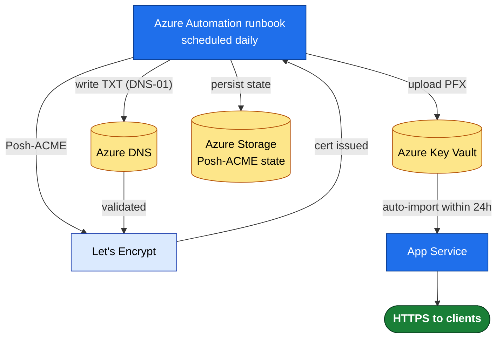

# 05 — Azure Web App (Posh-ACME + Automation) Runbook — ALTERNATIVE

**Use this instead of [04](04-Azure-Acmebot-Runbook.md) when** you want a **scripted, transparent** path with no Functions app to operate — e.g. you already run **Azure Automation**, you want the logic in source control, or policy discourages deploying the Acmebot Function.

**Tool:** [Posh-ACME](https://poshac.me/) running in an **Azure Automation** runbook on a schedule.
**Validation:** DNS-01 via **Azure DNS** (wildcards supported).
**Result:** A runbook issues/renews the Let's Encrypt cert, uploads it to **Key Vault**, and the Web App auto-imports it — same end state as Acmebot, but you own the script.

> **Trade-off:** more moving parts to maintain (module imports, state in Storage, your own renewal logic) and no dashboard. If you don't have a specific reason to script it, prefer **[04](04-Azure-Acmebot-Runbook.md)**.

---

## Architecture



> 📊 **Slide-ready image:** [PNG](docs/diagrams/runbook05-poshacme-arch.png) · [SVG](docs/diagrams/runbook05-poshacme-arch.svg)

---

## Prerequisites

- [ ] **Azure Automation Account**.
- [ ] **Azure DNS** hosting the domain's zone (or use CNAME delegation, see [02 §A](02-Windows-DNS01-Wildcard.md#section-a--cname-delegation-for-on-prem--api-less-dns)).
- [ ] **Key Vault** for the issued cert.
- [ ] **Storage Account** (blob container) to persist Posh-ACME state between runs.
- [ ] Web App with custom domain added & verified, on **Basic+** plan.

---

## Step 1 — Identity & permissions

Use the Automation Account's **system-assigned managed identity** (preferred) and scope it tightly:

```bash
PRINCIPAL=$(az automation account show -g <rg> -n <automation-acct> --query identity.principalId -o tsv)

# Write DNS-01 challenge records (zone scope only)
az role assignment create --assignee $PRINCIPAL --role "DNS Zone Contributor" \
  --scope "/subscriptions/<sub>/resourceGroups/<dns-rg>/providers/Microsoft.Network/dnszones/example.com"

# Write the issued cert into Key Vault
az role assignment create --assignee $PRINCIPAL --role "Key Vault Certificates Officer" \
  --scope "/subscriptions/<sub>/resourceGroups/<rg>/providers/Microsoft.KeyVault/vaults/<vault>"

# Read/write Posh-ACME state in blob storage
az role assignment create --assignee $PRINCIPAL --role "Storage Blob Data Contributor" \
  --scope "/subscriptions/<sub>/resourceGroups/<rg>/providers/Microsoft.Storage/storageAccounts/<sa>"
```

And let App Service read the vault (well-known principal, as in [04 Step 3](04-Azure-Acmebot-Runbook.md#step-3--let-app-service-read-certs-from-key-vault)):

```bash
az role assignment create --assignee "abfa0a7c-a6b6-4736-8310-5855508787cd" \
  --role "Key Vault Certificate User" \
  --scope "/subscriptions/<sub>/resourceGroups/<rg>/providers/Microsoft.KeyVault/vaults/<vault>"
```

---

## Step 2 — Import modules into the Automation Account

Add these from the PowerShell Gallery (Automation Account → Modules → Browse gallery), PowerShell 7.2 runtime:
`Posh-ACME`, `Az.Accounts`, `Az.Dns`, `Az.KeyVault`, `Az.Storage`.

---

## Step 3 — The runbook

A complete, parameterized runbook is provided at **[scripts/Renew-PoshACME.ps1](scripts/Renew-PoshACME.ps1)** — it runs both **on a Windows server** (Task Scheduler) and **in Azure Automation** (managed identity). The Azure path does:

1. `Connect-AzAccount -Identity` (managed identity).
2. Restore Posh-ACME state from the blob container.
3. `Set-PAServer` (staging or production), then `New-PACertificate` / `Submit-Renewal` for `*.example.com,example.com` using the **Azure** DNS plugin with managed-identity auth.
4. Export the PFX and `Import-AzKeyVaultCertificate` into the vault.
5. Persist Posh-ACME state back to the blob.

Core of the Azure branch (the script wraps this with logging/error handling):

```powershell
Connect-AzAccount -Identity | Out-Null
# (restore $env:POSHACME_HOME state from blob first)

Set-PAServer -DirectoryUrl 'https://acme-staging-v02.api.letsencrypt.org/directory'  # staging first

$pArgs = @{ AZSubscriptionId = '<sub>'; AZUseIMDS = $true }   # use the runbook's managed identity
New-PACertificate '*.example.com','example.com' `
    -AcceptTOS -Contact 'ops@example.com' `
    -Plugin Azure -PluginArgs $pArgs -Force

$cert = Get-PACertificate
Import-AzKeyVaultCertificate -VaultName '<vault>' -Name 'example-com' `
    -FilePath $cert.PfxFullChain -Password (ConvertTo-SecureString $cert.PfxPass -AsPlainText -Force)
# (persist state back to blob)
```

> `AZUseIMDS = $true` tells the Posh-ACME Azure plugin to authenticate with the runbook's managed identity instead of a stored secret — no credentials in the runbook.

---

## Step 4 — Schedule it

Automation Account → **Schedules** → create a **daily** schedule, link it to the runbook. Posh-ACME (and the script) only act when the cert is within the renewal window (~⅓ life remaining), so a daily run is cheap and self-throttling.

---

## Step 5 — Bind the cert to the Web App

Identical to [04 Step 5](04-Azure-Acmebot-Runbook.md#step-5--bind-the-cert-to-the-web-app):

```bash
az webapp config ssl import -g <rg> -n <webapp> --key-vault <vault> --key-vault-certificate-name example-com
THUMB=$(az webapp config ssl list -g <rg> --query "[?name=='example.com'].thumbprint" -o tsv)
az webapp config ssl bind -g <rg> -n <webapp> --certificate-thumbprint $THUMB --ssl-type SNI
```

Because the import uses the **non-version-specific** vault reference, future renewals auto-sync within 24h — no re-bind.

---

## Step 6 — Cut over to PRODUCTION

1. Change the runbook's `Set-PAServer`/`-DirectoryUrl` (or its parameter) to `https://acme-v02.api.letsencrypt.org/directory`.
2. Run the runbook once manually to issue a production cert into the vault.
3. Confirm the Web App syncs (or re-run the import) and the browser trusts the cert.

---

## Step 7 — Monitor

- **Automation job alerts:** alert on **failed runbook jobs** (Automation Account → Alerts, or a Log Analytics query on `AzureDiagnostics` for `JobStreams`/`Failed`).
- Add the hostname to the **independent expiry monitor** ([06](06-Monitoring-and-Alerting.md)).
- Keep the **Posh-ACME state blob** backed up — losing it means re-issuing (and re-hitting rate limits) rather than renewing.

---

### References
- [Posh-ACME docs](https://poshac.me/docs/v4/) · [Azure DNS plugin guide](https://poshac.me/docs/v4/Plugins/Azure/)
- Reference implementations: [AzAutomation-PoshACME](https://github.com/f-bader/AzAutomation-PoshACME) · [AzFuncCertRenewal](https://github.com/RylandDeGregory/AzFuncCertRenewal)
- Microsoft Learn: [Automation managed identity](https://learn.microsoft.com/en-us/azure/automation/enable-managed-identity-for-automation) · [import Key Vault cert to App Service](https://learn.microsoft.com/en-us/azure/app-service/configure-ssl-certificate)
