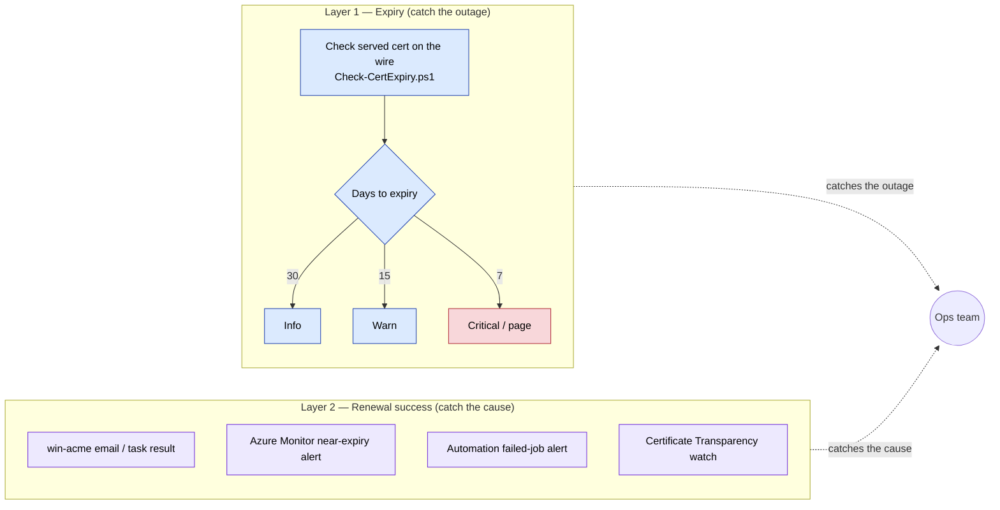

# 06 — Monitoring & Alerting

> **The single rule:** automation fails *silently*. A scheduled task can report "success" while the cert quietly ages out (expired DNS token, moved `wacs.exe`, revoked Key Vault role). The only defense is monitoring that is **independent of the renewal tool**. Every certificate this handbook automates must be registered here.

---

## Dual-layer model



> 📊 **Slide-ready image:** [PNG](docs/diagrams/monitoring-dual-layer.png) · [SVG](docs/diagrams/monitoring-dual-layer.svg)

You need **both**. Layer 1 tells you an outage is coming; Layer 2 tells you *why* the renewal didn't run so you can fix it before Layer 1 fires.

---

## Alert thresholds (standardize on these)

| Days to expiry | Severity | Action |
|----------------|----------|--------|
| 30 | Info | Renewal *should* already have happened. Note it. |
| 15 | **Warning** | Renewal is overdue — investigate the automation now. |
| 7 | **Critical / page** | Manual intervention required to avoid an outage. |
| 0 / expired | Incident | Follow the incident runbook in [07](07-Operations-and-Troubleshooting.md). |

For **45-day** certs, compress to **20 / 10 / 5**. For **6-day** certs you must use issuance/CT monitoring (Layer 2) — expiry thresholds are too coarse.

> Thresholds assume early renewal at ~⅓ life. If a 30-day alert ever fires on a 90-day cert, the automation already missed its window — treat it as a real warning, not noise.

---

## Layer 1 — Independent expiry monitoring

Use **[scripts/Check-CertExpiry.ps1](scripts/Check-CertExpiry.ps1)**. It connects to each `host:port`, reads the **served** certificate (not the local store, not the tool's log), and reports days-to-expiry — so it catches "renewed in the store but the service never re-bound" failures that tool-side checks miss.

```powershell
# One-off check
& "E:\NOC\SSL_Rotation_Windows\scripts\Check-CertExpiry.ps1" `
    -Targets "www.example.com:443","rdp.example.com:3389","app.azurewebsites.net:443" `
    -WarnDays 15 -CriticalDays 7

# Scheduled daily, emailing on threshold breach
& "E:\NOC\SSL_Rotation_Windows\scripts\Check-CertExpiry.ps1" `
    -TargetsFile "E:\NOC\SSL_Rotation_Windows\monitored-hosts.txt" `
    -WarnDays 15 -CriticalDays 7 `
    -SmtpServer "smtp.example.com" -To "ops@example.com" -RegisterTask
```

- Maintain `monitored-hosts.txt` (one `host:port` per line) as the **source of truth** for every automated cert. Adding a cert in any runbook = add its host here.
- The script outputs a Prometheus-style line per host too, so you can scrape it if you run Prometheus/Grafana.

**Run it from a *different* box than the one being renewed** where possible — that way a dead renewal host can't also silence its own monitoring.

### External/SaaS option

For public endpoints, a third-party monitor (e.g. [SSLMate Cert Spotter](https://sslmate.com/certspotter/), UptimeRobot, Pingdom SSL, [letsencrypt.org/docs/monitoring-service](https://letsencrypt.org/docs/monitoring-service/)) gives a fully independent check outside your network. Recommended for anything internet-facing in addition to the script.

---

## Layer 2 — Renewal-success monitoring per tool

### win-acme (Windows)

1. **Email on failure** — set `Notification.*` in `settings.json` (see [03 appendix](03-Windows-NonIIS-Services.md#appendix-settingsjson-reference)). Keep `EmailOnSuccess:false`.
2. **Scheduled-task health** — alert if the renew task didn't run or returned non-zero:
   ```powershell
   $t = Get-ScheduledTask -TaskPath "\win-acme*\"
   $i = Get-ScheduledTaskInfo -TaskName $t.TaskName
   [PSCustomObject]@{ Last=$i.LastRunTime; Result=('0x{0:X}' -f $i.LastTaskResult); Next=$i.NextRunTime }
   # LastTaskResult 0 = success. Anything else => alert.
   ```
   Wire this into your monitoring agent (Zabbix/SCOM/NinjaOne/etc.) as a check on `LastTaskResult` and `LastRunTime` freshness.
3. **Event log / file log** — win-acme writes to the Application event log (source `win-acme`) and `%programdata%\win-acme\...\Log`. Forward `Error`-level events to your SIEM.

### Azure free managed certificate

- Azure issues, renews, and re-binds it automatically, so there's no renewal job to watch. Rely on **Layer 1 (expiry on the wire)** as the cross-check, and optionally an **Azure Monitor** alert on the App Service certificate nearing expiry.

### Posh-ACME in Azure Automation (Runbook 05)

- Alert on **failed runbook jobs** (Automation Account → Alerts, or Log Analytics `AzureDiagnostics | where Category=='JobStreams' and ResultType=='Failed'`).

### Certificate Transparency (covers everything)

Every publicly trusted issuance is logged to **CT logs**. Watching CT for your domains confirms renewals are *actually being issued*, independent of every tool above — and flags unexpected/unauthorized issuance as a security bonus. Use [crt.sh](https://crt.sh/) for spot checks or [Cert Spotter](https://sslmate.com/certspotter/) for continuous alerts. (CT does not cover internal-only/private certs — those rely on Layer 1.)

---

## What to register where (checklist per cert)

When you finish any runbook, do all three:

- [ ] Add `host:port` to `monitored-hosts.txt` (Layer 1).
- [ ] Confirm the tool's failure alert is active (Layer 2: win-acme email / Azure Automation failed-job alert). *(Free Azure managed certs need no Layer-2 alert — Azure renews them.)*
- [ ] For public certs, add a CT-log watch and/or external SSL monitor.

---

## Suggested dashboard tiles

- Count of certs by **days-to-expiry bucket** (>30 / 15–30 / 7–15 / <7) from `Check-CertExpiry.ps1` output.
- win-acme **task LastTaskResult** per server (green/red).
- Azure Automation **failed jobs** (Posh-ACME runbook, last 7 days).
- Automation **failed jobs** (last 7 days).

---

### References
- [Let's Encrypt monitoring options](https://letsencrypt.org/docs/monitoring-service/)
- [SSLMate Cert Spotter](https://sslmate.com/certspotter/) · [crt.sh](https://crt.sh/)
- win-acme [notifications/settings](https://www.win-acme.com/reference/settings)
