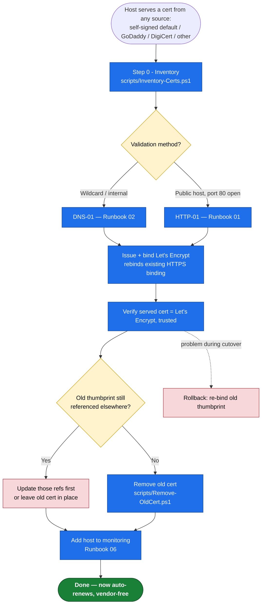

# 08 — Replacing an Existing Certificate (any vendor) with Let's Encrypt

**Use this when** a host already serves TLS from something else and you want Let's Encrypt to take over — automatically and with no downtime. The "something else" can be:

- the **default IIS self-signed** cert (untrusted "not secure" warning),
- a commercial cert nearing expiry — **GoDaddy, DigiCert, Sectigo, Entrust, …**,
- an imported **wildcard** from any vendor,
- a vendor cert bound to a **non-IIS** service (RDP/SQL/Exchange/HTTP.SYS).

This is a **cross-cutting** runbook: it works *with* Runbook [01](01-Windows-IIS-HTTP01-Runbook.md) (HTTP-01), [02](02-Windows-DNS01-Wildcard.md) (DNS-01 / wildcard), and [03](03-Windows-NonIIS-Services.md) (non-IIS). It only adds the migration-specific steps: inventory, cutover, cleanup, rollback.

---

## The one principle that makes this vendor-agnostic

> **Let's Encrypt does not "replace" the old certificate. It issues a brand-new certificate and re-points the binding at it.** The old cert keeps sitting in the Windows store until you remove it.

So **what CA issued the old cert is irrelevant** to issuance — self-signed, GoDaddy, and DigiCert are treated identically. The only vendor-specific reality is **where the old cert/keys live and what currently points at them**. Migration is therefore always the same three moves:

```
1. Issue + bind the Let's Encrypt cert   (rebinds the existing HTTPS binding — atomic, no downtime)
2. Verify the served cert is now Let's Encrypt and trusted
3. Remove the old cert  — only after verifying, and only once nothing else references it
```



> 📊 **Slide-ready image:** [PNG](docs/diagrams/runbook08-replace-existing.png) · [SVG](docs/diagrams/runbook08-replace-existing.svg)

---

## Step 0 — Inventory first (never skip this)

Before changing or deleting anything, know exactly what is bound where. Run:

```powershell
& "E:\NOC\SSL_Rotation_Windows\scripts\Inventory-Certs.ps1"
```

It lists every certificate in `LocalMachine\My` with its **issuer**, **expiry/days left**, **thumbprint**, and — critically — **what references it**: IIS site bindings, HTTP.SYS (`netsh`) bindings, and the RDP listener. That "referenced by" column is your safety check: it tells you what you're about to take over and whether an old thumbprint is **shared** by other bindings/services (in which case don't delete it yet).

Record, per host/site: current cert **subject**, **issuer** (the vendor), **expiry**, **thumbprint**, **binding type** (SNI vs IP SSL), and **other references**.

---

## Step 1 — Choose the validation method (prior CA is irrelevant)

| Your situation | Method | Runbook |
|----------------|--------|---------|
| Need a **wildcard** (e.g. your 3 wildcard domains) | DNS-01 | [02](02-Windows-DNS01-Wildcard.md) |
| Public single host, port 80 reachable | HTTP-01 | [01](01-Windows-IIS-HTTP01-Runbook.md) |
| Internal host / port 80 blocked | DNS-01 | [02](02-Windows-DNS01-Wildcard.md) |

> **GoDaddy as DNS *and* old cert issuer?** Those are independent. DNS-01 uses the GoDaddy **DNS API** to validate; the old GoDaddy **certificate** is simply removed at the end. You don't need GoDaddy (or DigiCert) to issue anything ever again.

---

## Step 2 — Issue and bind Let's Encrypt (no downtime)

Run the normal issuance from Runbook 01 (HTTP-01) or 02 (DNS-01 / wildcard). win-acme installs the new cert and switches the site's HTTPS binding to it in one step — the cert is in the store *before* the binding flips, so there is no meaningful downtime and no certless window, and it re-binds automatically on renewal.

**Wildcard takeover example** (replace a vendor wildcard, DNS-01, bind to IIS). Wildcards must use `--source manual`, which **requires `--installationsiteid`** for win-acme to bind into IIS:

```powershell
cd C:\win-acme
.\wacs.exe --source manual --host "*.example.com,example.com" `
  --validation cloudflare --cloudflareapitoken "<scoped-token>" `
  --store certificatestore `
  --installation iis --installationsiteid 1 `
  --emailaddress ops@example.com --accepttos --closeonfinish --verbose
```

Repeat per domain/site for your wildcards — or just run the **IIS script** (`irm https://xphox2.github.io/Cert-Man-Windows/setup-iis.ps1 | iex`), which plans, generates, and binds **all** covered sites (across multiple IIS sites) for you. See [02](02-Windows-DNS01-Wildcard.md) for the Azure DNS / GoDaddy / Manual variants and the on-prem CNAME-delegation pattern.

> **Where the cert lands:** with `--installation iis`, win-acme stores the cert in the **`WebHosting`** store (not `My`). Check both stores when verifying: `Get-ChildItem Cert:\LocalMachine\My, Cert:\LocalMachine\WebHosting`.

### Belt-and-suspenders (staged) variant

Want to verify the LE cert exists *before* touching the live binding? Issue to the store only, then switch the binding deliberately:

```powershell
# 1) Issue to the store, do NOT rebind yet
.\wacs.exe --source manual --host "*.example.com,example.com" `
  --validation cloudflare --cloudflareapitoken "<token>" `
  --store certificatestore --installation none `
  --emailaddress ops@example.com --accepttos --closeonfinish

# 2) Confirm the new cert is present (note its thumbprint). Check both stores.
Get-ChildItem Cert:\LocalMachine\My, Cert:\LocalMachine\WebHosting |
  Where-Object Subject -like "*example.com*" |
  Select-Object Subject, Issuer, NotAfter, Thumbprint, PSParentPath

# 3) Switch the IIS binding to the new cert (replaces the old cert on that binding)
Import-Module WebAdministration
$new = Get-ChildItem Cert:\LocalMachine\My, Cert:\LocalMachine\WebHosting |
  Where-Object { $_.Subject -like "*example.com*" -and $_.Issuer -like "*Let's Encrypt*" } |
  Sort-Object NotAfter -Descending | Select-Object -First 1
$store = ($new.PSParentPath -split '\\')[-1]   # My or WebHosting
Get-WebBinding -Name "MySite" -Protocol https | ForEach-Object { $_.AddSslCertificate($new.Thumbprint, $store) }
```

> The staged variant leaves win-acme renewal driven by the `manual` renewal it created; for IIS it's usually simpler to let `--source iis --installation iis` own the rebind so renewals re-bind automatically.

---

## Step 3 — Verify the cutover

```powershell
& "E:\NOC\SSL_Rotation_Windows\scripts\Check-CertExpiry.ps1" -Targets "www.example.com:443","portal.example.com:443"
```

Confirm for **every** affected hostname:
- **Issuer** is now *Let's Encrypt* (not the old vendor / not self-signed),
- the browser **trusts** it (no warning),
- expiry is ~90 days out,
- for a wildcard, spot-check a couple of subdomains.

Don't proceed to cleanup until all hosts pass.

---

## Step 4 — Remove the old certificate (safely)

Only after Step 3 passes, and only if inventory shows nothing else still uses that thumbprint:

```powershell
# Refuses to delete if the thumbprint is still bound anywhere (unless -Force).
& "E:\NOC\SSL_Rotation_Windows\scripts\Remove-OldCert.ps1" -Thumbprint "<old-vendor-thumbprint>" -BackupPath "C:\cert-backups"
```

`Remove-OldCert.ps1` re-checks references (IIS, HTTP.SYS, RDP), backs up the old cert first, then removes it from `LocalMachine\My`. On the **vendor side**, also cancel auto-renew/billing for the retired cert (GoDaddy/DigiCert) so you stop paying for it.

**Default self-signed cleanup:** if you replaced the default IIS self-signed cert ("IIS Express Development Certificate" or the auto `localhost`/machine self-signed on :443), remove it too — it was never trusted and only causes confusion.

---

## Step 5 — Rollback (only needed during the cutover window)

This is *why* you keep the old cert until Step 3 passes. If the new binding misbehaves, re-bind the old thumbprint:

```powershell
Import-Module WebAdministration
Get-WebBinding -Name "MySite" -Protocol https | ForEach-Object { $_.AddSslCertificate("<old-thumbprint>", "My") }
# HTTP.SYS service instead? re-point with scripts\Bind-HttpSysCert.ps1 -NewThumbprint <old>
```

Once Let's Encrypt is confirmed good and the old cert removed, rollback is no longer possible (re-issue from the vendor would be required) — which is the point.

---

## Non-IIS services (RDP / SQL / Exchange / HTTP.SYS)

The takeover is identical in spirit: the LE cert is issued the same way, and the **post-renewal deploy script** from [Runbook 03](03-Windows-NonIIS-Services.md) re-points the service from the old vendor thumbprint to the new LE thumbprint and restarts it. The **first** run of `Deploy-RDP-Cert.ps1` / `Deploy-SQLServer-Cert.ps1` / `Deploy-Exchange-Cert.ps1` / `Bind-HttpSysCert.ps1` *is* the migration; every run after is just renewal. Nothing about the old CA changes the procedure.

---

## Gotchas specific to changing CAs

- **Certificate / public-key pinning is the one real trap.** If clients pin the old vendor cert's key (HPKP, mobile apps, B2B integrations, or anything that trusts *only* a specific CA), switching to Let's Encrypt breaks them. Inventory pinning **before** cutover and coordinate client updates. This is the single place where "vendor-agnostic on the server" is not automatically "vendor-agnostic on the client." See [07 §Gotchas](07-Operations-and-Troubleshooting.md#gotchas-to-know-before-they-bite).
- **Leftover intermediates** in the Intermediate CA store from the old vendor are harmless — Let's Encrypt ships its own chain. Leave them.
- **Keep the binding type the same** — if the site used IP SSL, stay IP SSL; if SNI, stay SNI. You're swapping the cert, not the binding model.
- **HSTS** is unaffected by a CA change (it pins transport, not the cert) — but it still blocks HTTP-01, so wildcard/HSTS hosts use DNS-01 anyway.
- **Shared thumbprints**: if one vendor cert was bound to several sites/services, take them all over (or update each reference) before removing it. `Inventory-Certs.ps1` surfaces these.

---

## Verification & monitoring

Add every migrated hostname to `monitored-hosts.txt` ([06](06-Monitoring-and-Alerting.md)). From here on, the renewal automation owns these certs — no more vendor portals, manual CSRs, or calendar reminders.

---

### References
- Builds on Runbooks [01](01-Windows-IIS-HTTP01-Runbook.md) / [02](02-Windows-DNS01-Wildcard.md) / [03](03-Windows-NonIIS-Services.md); gotchas in [07](07-Operations-and-Troubleshooting.md).
- win-acme [IIS binding behavior](https://www.win-acme.com/manual/getting-started) · [Microsoft: IIS HTTPS bindings](https://learn.microsoft.com/en-us/iis/manage/configuring-security/how-to-set-up-ssl-on-iis)
