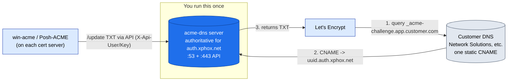

# 09 — acme-dns Server Setup

**Use this when** you want a **self-contained delegation server you operate** — the MSP model: stand up **one** acme-dns server and every customer (whatever registrar they use, even no-API ones like Network Solutions) adds a **single static CNAME** pointing at it, and from then on all their certs validate and renew automatically.

> **acme-dns is one option, not the only one — and for most cases you don't need to run a server.** **win-acme follows the `_acme-challenge` CNAME automatically** (`Validation.AllowDnsSubstitution = true`, default) to a delegation zone you control, and **Posh-ACME `-DnsAlias`** ([`scripts/Issue-DnsAlias.ps1`](scripts/Issue-DnsAlias.ps1)) does the same in pure PowerShell — both with **no acme-dns server**. Self-host acme-dns (this runbook) only when you specifically want one server that many customers delegate to. The public `https://auth.acme-dns.io` is **test-only, not production-safe** — self-host for production. Alternatives are compared in [Runbook 02 §A](02-Windows-DNS01-Wildcard.md#section-a--any-dns-with-no-api-network-solutions--registrars-without-an-api).

This is the server side. The client side (win-acme on Windows, Posh-ACME on Azure) is in [Runbook 02 §A](02-Windows-DNS01-Wildcard.md#section-a--any-dns-with-no-api-network-solutions--registrars-without-an-api). Background: [acme-dns](https://github.com/acme-dns/acme-dns).

---

## The model (one server, every customer CNAMEs to it)



> 📊 **Slide-ready image:** [PNG](docs/diagrams/runbook09-acmedns.png) · [SVG](docs/diagrams/runbook09-acmedns.svg)

---

## Prerequisites

- [ ] A **host with a static public IP** (small Linux VM/container ideal; acme-dns is a single Go binary). 256 MB RAM is plenty.
- [ ] A **subdomain you control to dedicate**, e.g. `auth.xphox.net`. You'll make the acme-dns server authoritative for it.
- [ ] Ability to edit the **parent zone** (`xphox.net`) to add the delegation (NS + glue A).
- [ ] Firewall/NSG open **inbound**: **53/udp + 53/tcp** (DNS) and **80 + 443** (the HTTP API + its own Let's Encrypt cert).

---

## Step 1 — Delegate the subdomain to the server

In the **parent zone** (`xphox.net`, wherever it's hosted), add:

| Type | Name | Value |
|------|------|-------|
| A | `auth.xphox.net` | `<public IP of the acme-dns host>`  (glue) |
| NS | `auth.xphox.net` | `auth.xphox.net.`  (self-referential — acme-dns is its own nameserver) |

This delegates `auth.xphox.net` to the acme-dns server. (On Cloudflare/registrar UIs: one A record and one NS record on name `auth`.)

---

## Step 2 — `config.cfg`

```ini
[general]
listen   = "0.0.0.0:53"          # public DNS listener (NOT 127.0.0.1 for a real server)
protocol = "both"                 # udp + tcp
domain   = "auth.xphox.net"       # the subdomain you delegated
nsname   = "auth.xphox.net"       # this server's NS name
nsadmin  = "admin.xphox.net"      # SOA contact (admin@xphox.net)
records  = [                      # the server answers these for itself
    "auth.xphox.net. A <public-ip>",
    "auth.xphox.net. NS auth.xphox.net.",
]
debug = false

[database]
engine     = "sqlite3"
connection = "/var/lib/acme-dns/acme-dns.db"

[api]
ip                  = "0.0.0.0"
port                = "443"
tls                 = "letsencrypt"   # acme-dns gets its OWN Let's Encrypt cert for the API (needs :80+:443)
notification_email  = "admin@xphox.net"
acme_cache_dir      = "api-certs"
disable_registration = false          # set true AFTER you've registered all accounts (below)
corsorigins         = ["*"]
use_header          = false           # true only if behind a reverse proxy (then set header_name)
header_name         = "X-Forwarded-For"

[logconfig]
loglevel  = "info"
logtype   = "stdout"
logformat = "text"
```

Replace `<public-ip>` and the `xphox.net` names with yours.

---

## Step 3 — Run it

### One command (recommended): `Deploy-AcmeDns.ps1`
Generates `config.cfg` from parameters, runs the container with the right ports/volumes, verifies, and prints the exact delegation records to add. Needs Docker; runs under Windows PowerShell or `pwsh` on Linux.

```powershell
& "E:\NOC\SSL_Rotation_Windows\scripts\Deploy-AcmeDns.ps1" `
    -Domain auth.xphox.net -PublicIP 198.51.100.10 -NotificationEmail admin@xphox.net
```
(Steps 1 & 2 are done for you — it writes the config and starts the server. For a quick HTTP-only test, add `-ApiTls none`.)

### Or docker-compose
The [`acme-dns/`](acme-dns/) folder has a `docker-compose.yml` + `config.cfg.example`: copy the example to `config/config.cfg`, edit it (Step 2), then `docker compose up -d`.

### Or plain Docker
```bash
docker run -d --name acme-dns --restart unless-stopped \
  -p 53:53 -p 53:53/udp -p 80:80 -p 443:443 \
  -v /srv/acme-dns/config:/etc/acme-dns:ro \
  -v /srv/acme-dns/data:/var/lib/acme-dns \
  joohoi/acme-dns
```
(Put `config.cfg` in `/srv/acme-dns/config`. The sqlite DB persists in `/srv/acme-dns/data`.)

### Linux without Docker (systemd)
Build/download the binary from [github.com/acme-dns/acme-dns](https://github.com/acme-dns/acme-dns/releases), place `config.cfg` next to it, and run under systemd. Give it `CAP_NET_BIND_SERVICE` so it can bind :53/:80/:443 as non-root.

### Windows
acme-dns ships **no official Windows binary** (releases are Linux-only). On a Windows host the supported path is **Docker Desktop** (use `Deploy-AcmeDns.ps1` or the compose file above). If you specifically want a native service, build `acme-dns.exe` from Go source (`go build`) and run it under **NSSM** / `New-Service` with `config.cfg` alongside — but Docker is simpler and is what this runbook assumes.

---

## Step 4 — Lock it down

acme-dns is minimal by design, but tighten these:

- **Restrict who can use a registration:** when you register an account (Step 6), pass **`allowfrom`** CIDRs so only your cert servers' IPs can push TXT updates for it.
- **Stop new registrations once set up:** after you've registered all the accounts you need, set **`disable_registration = true`** and restart — now nobody can create new accounts on your server.
- **Firewall the API:** if all your cert servers have known IPs, restrict inbound **:443** to them at the firewall (DNS :53 must stay open to the world so the CA can query it).
- **Back up `acme-dns.db`** — it holds every registration. Losing it means re-registering and re-pointing every CNAME. Snapshot it with the host.

---

## Step 5 — Verify the server

From anywhere:
```bash
# Delegation works + server answers authoritatively for its zone
dig NS auth.xphox.net +short
dig @<public-ip> SOA auth.xphox.net +short

# API is up (should return 404/registration JSON, i.e. it's listening with a valid TLS cert)
curl -i https://auth.xphox.net/register -X POST -H "Content-Type: application/json" -d '{}'
```
A `201 Created` with a JSON body (username/password/fulldomain/subdomain) means the full stack works.

---

## Step 6 — Onboard a domain (per customer/host)

1. **Register an account** (optionally scoped to your cert server's IP):
   ```bash
   curl -s https://auth.xphox.net/register -X POST -H "Content-Type: application/json" \
     -d '{"allowfrom":["<cert-server-ip>/32"]}'
   ```
   Returns `username`, `password`, `subdomain`, and **`fulldomain`** (e.g. `8e5700ea-….auth.xphox.net`).
2. **At the customer's registrar (Network Solutions, etc.), add ONE static CNAME** — one per **registrable domain** (covers wildcard + apex):
   ```
   _acme-challenge.app.customer.com.   CNAME   8e5700ea-….auth.xphox.net.
   ```
3. On the cert server, point the client at this acme-dns:
   - **win-acme / our scripts:** run `preflight.ps1` or `setup-iis.ps1`, choose **acme-dns**, give the server URL `https://auth.xphox.net`. (win-acme stores the registration; on first use for a host it prints the CNAME — it matches the `fulldomain` above.)
   - **Posh-ACME (Azure):** plugin `Acme-Dns`, with the server URL + the registration values.

Once the CNAME exists, issuance and **all future renewals are automatic** — the client only ever talks to your acme-dns.

---

## Operations

- **Backups:** `acme-dns.db` (Step 4). This is the only stateful piece.
- **Monitoring:** alert on the acme-dns host being down (DNS :53 unreachable breaks every renewal across all customers). Add `auth.xphox.net:443` to your expiry/uptime checks.
- **HA (optional):** run two acme-dns nodes sharing a database (Postgres `engine = "postgres"`) and list both as NS for `auth.xphox.net`.
- **One server, many customers:** the same acme-dns serves unlimited domains — each gets its own registration + CNAME. This is the MSP-friendly part.

---

### References
- [acme-dns (GitHub)](https://github.com/acme-dns/acme-dns) · [Docker image](https://hub.docker.com/r/joohoi/acme-dns)
- Client side: [Runbook 02 §A](02-Windows-DNS01-Wildcard.md#section-a--any-dns-with-no-api-network-solutions--registrars-without-an-api) · [win-acme acme-dns](https://www.win-acme.com/reference/plugins/validation/dns/acme-dns) · [Posh-ACME Acme-Dns plugin](https://poshac.me/docs/v4/Plugins/Acme-Dns/)
