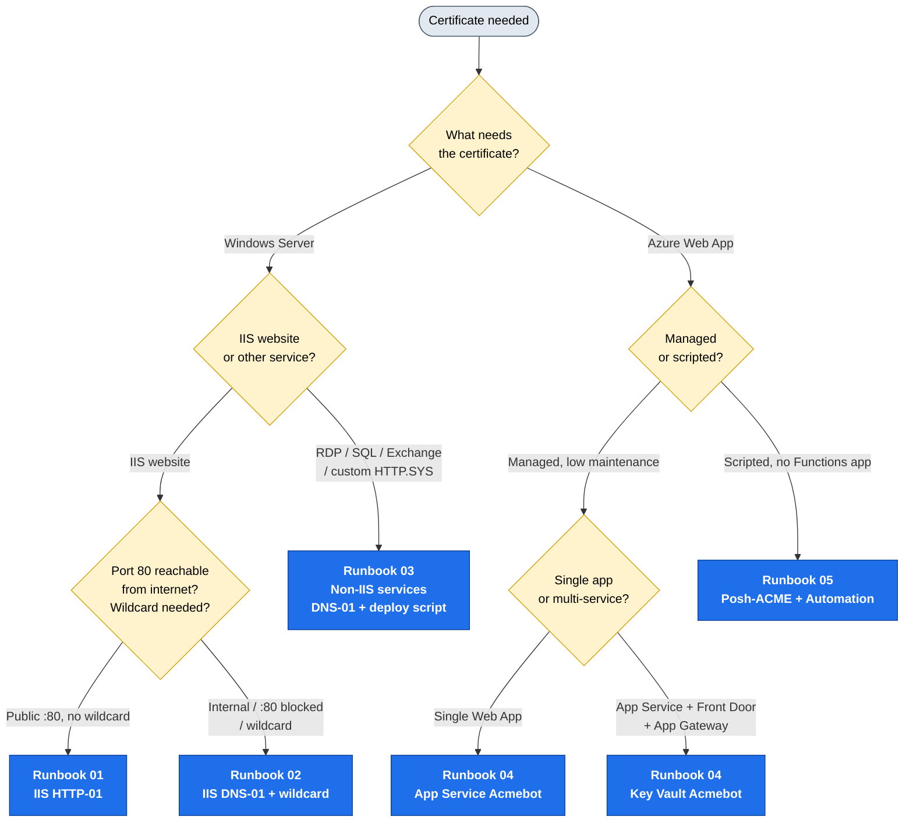

# SSL Certificate Rotation Automation — Operations Handbook

**Owner:** NOC / Infrastructure Operations
**Scope:** Automated issuance and renewal of **Let's Encrypt** SSL/TLS certificates for (1) Windows Server services and (2) Azure Web Apps / App Service.
**Audience:** Any operator. No prior ACME / PKI knowledge assumed — follow the runbook for your scenario top to bottom.

---

## Why this handbook exists

Certificate lifetimes have collapsed. We used to renew once a year (365 days). Public CAs are now on a CA/Browser Forum–mandated schedule that drops the maximum TLS certificate lifetime to **~47 days by 2029**, and Let's Encrypt certificates are already **90 days** (moving to **45 days during 2026**, with 6‑day short‑lived certs generally available).

Renewing by hand every 30–90 days does not scale and is error‑prone — a missed renewal is a public outage. **Automation is now mandatory, not optional.** This handbook standardizes how we automate it.

See **[00-Background-and-Concepts.md](00-Background-and-Concepts.md)** for the "why" and the ACME fundamentals. If you just need to get a certificate automated right now, use the decision flow below.

---

## Master decision flow — "Which runbook do I use?"

> 📊 **Slide-ready image:** [PNG](docs/diagrams/master-decision-flow.png) · [SVG](docs/diagrams/master-decision-flow.svg) — see [docs/diagrams/](docs/diagrams/) for all flow diagrams.

### Quick lookup table

| Your situation | Runbook | Tool | Validation |
|----------------|---------|------|-----------|
| Public IIS website, port 80 reachable | **[01](01-Windows-IIS-HTTP01-Runbook.md)** | win-acme | HTTP-01 |
| Internal IIS, port 80 blocked, **or** any wildcard `*.domain` | **[02](02-Windows-DNS01-Wildcard.md)** | win-acme | DNS-01 |
| RDP, SQL Server, Exchange, or custom HTTP.SYS service | **[03](03-Windows-NonIIS-Services.md)** | win-acme / Posh-ACME | DNS-01 (usually) |
| Azure Web App — single app, low maintenance | **[04](04-Azure-Acmebot-Runbook.md)** | App Service Acmebot | DNS-01 |
| Azure — cert shared across App Service + Front Door + App Gateway | **[04](04-Azure-Acmebot-Runbook.md)** | Key Vault Acmebot | DNS-01 |
| Azure — scripted/runbook approach, no Functions app | **[05](05-Azure-PoshACME-Runbook.md)** | Posh-ACME + Automation | DNS-01 |

> **Wildcard certificates (`*.example.com`) always require DNS-01.** HTTP-01 cannot issue wildcards. If you need a wildcard, you are on a DNS-01 runbook (02, 04, or 05).

---

## Golden rules (apply to every runbook)

1. **Test in staging first.** Always validate new automation against the Let's Encrypt **staging** endpoint before switching to production. Production has hard rate limits (50 certs/registered-domain/week, 5 duplicate certs/week); staging does not bite. Cutover steps are in each runbook and in [07](07-Operations-and-Troubleshooting.md).
2. **Renew early.** Renew at roughly **⅓ of lifetime remaining** (≈30 days out on a 90‑day cert, ≈15 days on a 45‑day cert). Every tool here defaults to early renewal.
3. **Monitor independently.** Renewal automation can fail silently. A **separate** expiry monitor that does not depend on the renewal tool is mandatory — see [06](06-Monitoring-and-Alerting.md).
4. **Least privilege for credentials.** DNS API tokens and Azure identities get the minimum scope required (one DNS zone, certificate-only Key Vault roles). Never store DNS API tokens in plaintext where they can leak.
5. **Document every issued cert.** Record the host, runbook used, validation method, DNS provider, and renewal owner so the next operator can troubleshoot.

---

## Handbook contents

| File | Purpose |
|------|---------|
| [00-Background-and-Concepts.md](00-Background-and-Concepts.md) | ACME/Let's Encrypt fundamentals, cert lifetime timeline, challenge types, rate limits, staging, ARI, wildcard rules. Read once. |
| [01-Windows-IIS-HTTP01-Runbook.md](01-Windows-IIS-HTTP01-Runbook.md) | Public IIS sites — win-acme HTTP-01, fully unattended. |
| [02-Windows-DNS01-Wildcard.md](02-Windows-DNS01-Wildcard.md) | Internal IIS + wildcard — win-acme DNS-01 (Azure / Cloudflare / GoDaddy, on-prem CNAME delegation). |
| [03-Windows-NonIIS-Services.md](03-Windows-NonIIS-Services.md) | RDP, SQL Server, Exchange, custom HTTP.SYS — post-renewal binding scripts. |
| [04-Azure-Acmebot-Runbook.md](04-Azure-Acmebot-Runbook.md) | **Primary Azure path** — App Service / Key Vault Acmebot. |
| [05-Azure-PoshACME-Runbook.md](05-Azure-PoshACME-Runbook.md) | Alternative Azure path — Posh-ACME + Azure Automation runbook. |
| [06-Monitoring-and-Alerting.md](06-Monitoring-and-Alerting.md) | Dual-layer monitoring, alert thresholds, expiry checks. |
| [07-Operations-and-Troubleshooting.md](07-Operations-and-Troubleshooting.md) | Incident runbook, failure modes, gotchas, rate-limit recovery, staging→prod cutover. |
| [scripts/](scripts/) | Ready-to-run PowerShell: install, deploy-to-service, monitoring, Posh-ACME renewal. |
| [docs/diagrams/](docs/diagrams/) | All flow diagrams (Mermaid source + SVG/PNG exports) for training and slides. |
| [CHANGELOG.md](CHANGELOG.md) | Handbook version history. |

---

## At-a-glance: the tools we standardize on

- **[win-acme](https://www.win-acme.com/)** (`wacs.exe`) — the primary Windows ACME client. Auto-creates a Windows Scheduled Task, auto-binds to IIS, supports 20+ DNS plugins, and runs post-renewal scripts for non-IIS services. (Successor fork **[simple-acme](https://simple-acme.com/)** is noted where relevant; commands are compatible.)
- **[Posh-ACME](https://poshac.me/)** + **[Posh-ACME.Deploy](https://github.com/rmbolger/Posh-ACME.Deploy)** — PowerShell-native ACME client for complex/non-IIS deployments and Azure runbooks. 100+ DNS plugins.
- **[App Service Acmebot](https://github.com/shibayan/appservice-acmebot)** / **[Key Vault Acmebot](https://github.com/shibayan/keyvault-acmebot)** — Azure Functions apps (with dashboard) that fully automate Let's Encrypt for Azure, storing certs in Key Vault for hands-off auto-rotation.

> **Not** the same as the built-in **App Service Managed Certificate** (free, DigiCert-issued, no wildcard, non-exportable). We use Let's Encrypt for wildcard support, export/portability, and a single CA across on-prem + cloud. See [04](04-Azure-Acmebot-Runbook.md) for the comparison.
