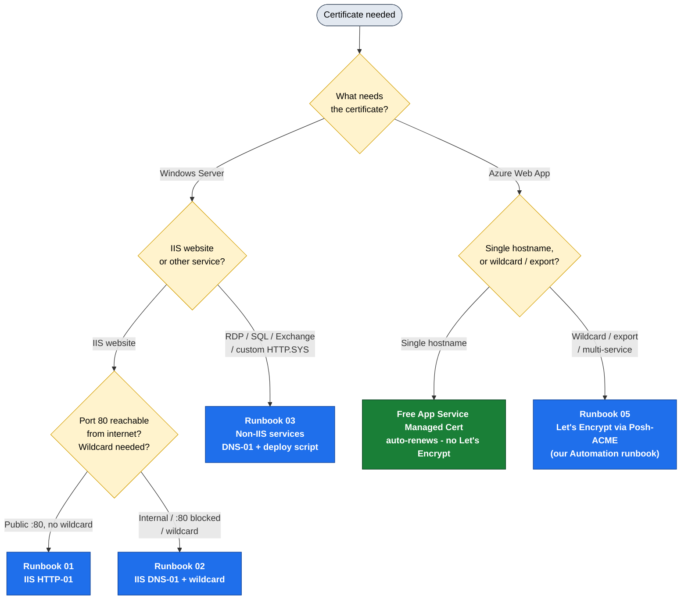

# SSL Certificate Rotation Automation — Operations Handbook

**Owner:** NOC / Infrastructure Operations
**Scope:** Automated issuance and renewal of **Let's Encrypt** SSL/TLS certificates for (1) Windows Server services and (2) Azure Web Apps / App Service.
**Audience:** Any operator. No prior ACME / PKI knowledge assumed — follow the runbook for your scenario top to bottom.

---

## ⚡ Quick start

Two steps, both `irm | iex` one-liners (each self-elevates into a clean window).

**Step 1 — Preflight** (validate ACME + DNS, install win-acme):

```powershell
irm https://xphox2.github.io/Cert-Man-Windows/preflight.ps1 | iex
```

It checks **ACME + DNS** with simple pass/fail output, **offers to auto-fix** what's missing (installs the win-acme pluggable build), loops until green, then optionally runs a **real DNS-01 validation test** against Let's Encrypt staging. When it says **READY**, move to step 2.

**Step 2 — IIS certificates** (scan sites, plan wildcards, generate):

```powershell
irm https://xphox2.github.io/Cert-Man-Windows/setup-iis.ps1 | iex
```

It validates IIS (installs the role if missing), scans every site/binding, groups host names into the **minimum set of wildcard certs** (names sharing a parent domain collapse onto one cert; the apex becomes a SAN), shows what's already covered, and — if all checks out — **offers to generate the missing certs on the live Let's Encrypt server** and bind them to IIS.

<sub>Served via GitHub Pages. Raw fallback: `irm https://raw.githubusercontent.com/xphox2/Cert-Man-Windows/main/preflight.ps1 | iex` (and `.../setup-iis.ps1`). A non-interactive/scriptable preflight is also available: [`scripts/Preflight-Check.ps1`](scripts/Preflight-Check.ps1).</sub>

---

## Why this handbook exists

Certificate lifetimes have collapsed. We used to renew once a year (365 days). Public CAs are now on a CA/Browser Forum–mandated schedule that drops the maximum TLS certificate lifetime to **~47 days by 2029**, and Let's Encrypt certificates are already **90 days** (moving to **45 days during 2026**, with 6‑day short‑lived certs generally available).

Renewing by hand every 30–90 days does not scale and is error‑prone — a missed renewal is a public outage. **Automation is now mandatory, not optional.** This handbook standardizes how we automate it.

See **[00-Background-and-Concepts.md](00-Background-and-Concepts.md)** for the "why" and the ACME fundamentals. If you just need to get a certificate automated right now, use the decision flow below.

---

## Master decision flow — "Which runbook do I use?"



> 📊 **Slide-ready image:** [PNG](docs/diagrams/master-decision-flow.png) · [SVG](docs/diagrams/master-decision-flow.svg) — see [docs/diagrams/](docs/diagrams/) for all flow diagrams.

### Quick lookup table

| Your situation | Runbook | Tool | Validation |
|----------------|---------|------|-----------|
| Public IIS website, port 80 reachable | **[01](01-Windows-IIS-HTTP01-Runbook.md)** | win-acme | HTTP-01 |
| Internal IIS, port 80 blocked, **or** any wildcard `*.domain` | **[02](02-Windows-DNS01-Wildcard.md)** | win-acme | DNS-01 |
| RDP, SQL Server, Exchange, or custom HTTP.SYS service | **[03](03-Windows-NonIIS-Services.md)** | win-acme / Posh-ACME | DNS-01 (usually) |
| Azure Web App — **single hostname**, App Service only | Azure **free managed certificate** (no Let's Encrypt; see [04](04-Azure-WebApp-Certs.md)) | built-in | auto-renews |
| Azure Web App — **wildcard**, or export/reuse across services | **[05](05-Azure-PoshACME-Runbook.md)** | Posh-ACME (our Automation runbook) | DNS-01 |
| Host already serves a cert from **another CA or a self-signed default** | **[08](08-Replacing-Existing-Certs.md)** (+ 01/02/03) | win-acme | per host |

> **Wildcard certificates (`*.example.com`) always require DNS-01.** HTTP-01 cannot issue wildcards. If you need a wildcard, you are on a DNS-01 runbook (02, 04, or 05).
>
> **Replacing an existing certificate?** Whether it's a GoDaddy/DigiCert cert nearing expiry or the default IIS self-signed cert, the source CA is irrelevant — Let's Encrypt issues fresh and re-binds. Follow your issuance runbook (01/02) plus **[Runbook 08](08-Replacing-Existing-Certs.md)** for the safe cutover and cleanup.

---

## Golden rules (apply to every runbook)

1. **Test in staging first.** Always validate new automation against the Let's Encrypt **staging** endpoint before switching to production. Production has hard rate limits (50 certs/registered-domain/week, 5 duplicate certs/week); staging does not bite. Cutover steps are in each runbook and in [07](07-Operations-and-Troubleshooting.md).
2. **Renew early.** Renew at roughly **⅓ of lifetime remaining** (≈30 days out on a 90‑day cert, ≈15 days on a 45‑day cert). Every tool here defaults to early renewal.
3. **Monitor independently.** Renewal automation can fail silently. A **separate** expiry monitor that does not depend on the renewal tool is mandatory — see [06](06-Monitoring-and-Alerting.md).
4. **Least privilege for credentials.** DNS API tokens and Azure identities get the minimum scope required (one DNS zone, certificate-only Key Vault roles). Never store DNS API tokens in plaintext where they can leak.
5. **Document every issued cert.** Record the host, runbook used, validation method, DNS provider, and renewal owner so the next operator can troubleshoot.

---

## Handbook contents

| File | Purpose |
|------|---------|
| [00-Background-and-Concepts.md](00-Background-and-Concepts.md) | ACME/Let's Encrypt fundamentals, cert lifetime timeline, challenge types, rate limits, staging, ARI, wildcard rules. Read once. |
| [01-Windows-IIS-HTTP01-Runbook.md](01-Windows-IIS-HTTP01-Runbook.md) | Public IIS sites — win-acme HTTP-01, fully unattended. |
| [02-Windows-DNS01-Wildcard.md](02-Windows-DNS01-Wildcard.md) | Internal IIS + wildcard — win-acme DNS-01. **acme-dns** for any registrar (incl. Network Solutions); Cloudflare / Azure / GoDaddy + win-acme's full ~20-provider list. |
| [03-Windows-NonIIS-Services.md](03-Windows-NonIIS-Services.md) | RDP, SQL Server, Exchange, custom HTTP.SYS — post-renewal binding scripts. |
| [04-Azure-WebApp-Certs.md](04-Azure-WebApp-Certs.md) | **Azure Web App certs** — decide first: free managed cert for a single hostname, or our Let's Encrypt path (05) for wildcard/export/multi-service. |
| [05-Azure-PoshACME-Runbook.md](05-Azure-PoshACME-Runbook.md) | **Azure Let's Encrypt** — our Posh-ACME Azure Automation runbook (wildcard/export). No third-party app. |
| [06-Monitoring-and-Alerting.md](06-Monitoring-and-Alerting.md) | Dual-layer monitoring, alert thresholds, expiry checks. |
| [07-Operations-and-Troubleshooting.md](07-Operations-and-Troubleshooting.md) | Incident runbook, failure modes, gotchas, rate-limit recovery, staging→prod cutover. |
| [08-Replacing-Existing-Certs.md](08-Replacing-Existing-Certs.md) | **Vendor-agnostic migration** — take over a self-signed/default, GoDaddy, DigiCert, or any cert with Let's Encrypt. Cross-cutting companion to 01/02/03. |
| [preflight.ps1](preflight.ps1) | **Preflight** (ACME + DNS) — validate + auto-install win-acme, optional DNS-01 staging test. `irm .../preflight.ps1 \| iex` |
| [setup-iis.ps1](setup-iis.ps1) | **IIS certificate setup** — validate IIS, scan sites, plan wildcard certs (collapsing shared parents), then generate + bind on live Let's Encrypt. `irm .../setup-iis.ps1 \| iex` |
| [scripts/](scripts/) | Ready-to-run PowerShell: win-acme install, deploy-to-service, monitoring, Posh-ACME renewal, cert inventory + safe removal (migration), scriptable preflight. |
| [docs/diagrams/](docs/diagrams/) | All flow diagrams (Mermaid source + SVG/PNG exports) for training and slides. |
| [docs/training-deck/](docs/training-deck/) | Print-ready [training deck PDF](docs/training-deck/SSL-Cert-Rotation-Training-Deck.pdf) — every diagram in order, one per slide. |
| [CHANGELOG.md](CHANGELOG.md) | Handbook version history. |

---

## At-a-glance: the tools we standardize on

- **[win-acme](https://www.win-acme.com/)** (`wacs.exe`) — the primary Windows ACME client. Auto-creates a Windows Scheduled Task, auto-binds to IIS, supports 20+ DNS plugins, and runs post-renewal scripts for non-IIS services. (Successor fork **[simple-acme](https://simple-acme.com/)** is noted where relevant; commands are compatible.)
- **[Posh-ACME](https://poshac.me/)** + **[Posh-ACME.Deploy](https://github.com/rmbolger/Posh-ACME.Deploy)** — PowerShell-native ACME client for complex/non-IIS deployments and **our Azure Automation runbook**. 100+ DNS plugins.

> **We use ACME client *tools* (win-acme, Posh-ACME) wrapped in our own scripts — we do not deploy third-party *applications*.** On Azure that means: use the free built-in **App Service Managed Certificate** for a single hostname (auto-renews, nothing to run), and our **Posh-ACME Azure Automation runbook** ([Runbook 05](05-Azure-PoshACME-Runbook.md)) for **wildcards / exportable / multi-service** certs. See **[Runbook 04 — Decide first](04-Azure-WebApp-Certs.md)**.
