# Diagrams

Visual flows for the SSL Certificate Rotation handbook, for training and presentations.

Each diagram exists in three forms:
- **Inline Mermaid** in the runbook itself — GitHub renders it automatically when you read the doc.
- **`<name>.svg`** — scalable vector, ideal for the web/wiki and crisp at any zoom.
- **`<name>.png`** — high-resolution raster (3×), drop straight into PowerPoint or printed handouts.

The editable source for every diagram is in **[`src/`](src/)** (`.mmd` Mermaid files).

## How to edit / re-render

1. Edit the relevant `src/<name>.mmd` (and keep the matching inline ```mermaid block in the runbook in sync).
2. Re-render both image formats:
   ```powershell
   # one-time: npm install -g @mermaid-js/mermaid-cli
   .\render-diagrams.ps1
   ```
   Styling/theme is controlled by [`mmdc-config.json`](mmdc-config.json).

## Index

| Diagram | Used in | Source | Images |
|---------|---------|--------|--------|
| Master "which runbook?" decision flow | [README](../../README.md) | [src](src/master-decision-flow.mmd) | [PNG](master-decision-flow.png) · [SVG](master-decision-flow.svg) |
| IIS HTTP-01 process | [Runbook 01](../../01-Windows-IIS-HTTP01-Runbook.md) | [src](src/runbook01-iis-http01.mmd) | [PNG](runbook01-iis-http01.png) · [SVG](runbook01-iis-http01.svg) |
| DNS-01 / wildcard process | [Runbook 02](../../02-Windows-DNS01-Wildcard.md) | [src](src/runbook02-dns01.mmd) | [PNG](runbook02-dns01.png) · [SVG](runbook02-dns01.svg) |
| CNAME delegation (on-prem DNS) | [Runbook 02 §A](../../02-Windows-DNS01-Wildcard.md) | [src](src/cname-delegation.mmd) | [PNG](cname-delegation.png) · [SVG](cname-delegation.svg) |
| Non-IIS renewal → deploy model | [Runbook 03](../../03-Windows-NonIIS-Services.md) | [src](src/runbook03-noniis-model.mmd) | [PNG](runbook03-noniis-model.png) · [SVG](runbook03-noniis-model.svg) |
| Posh-ACME + Automation architecture | [Runbook 05](../../05-Azure-PoshACME-Runbook.md) | [src](src/runbook05-poshacme-arch.mmd) | [PNG](runbook05-poshacme-arch.png) · [SVG](runbook05-poshacme-arch.svg) |
| Dual-layer monitoring | [Runbook 06](../../06-Monitoring-and-Alerting.md) | [src](src/monitoring-dual-layer.mmd) | [PNG](monitoring-dual-layer.png) · [SVG](monitoring-dual-layer.svg) |
| Replace an existing cert (vendor-agnostic) | [Runbook 08](../../08-Replacing-Existing-Certs.md) | [src](src/runbook08-replace-existing.mmd) | [PNG](runbook08-replace-existing.png) · [SVG](runbook08-replace-existing.svg) |

## Preview

### Master decision flow

